# SurveilAMR: Vivli AMR 2026 Data Challenge

**Surveillance Intelligence for Antimicrobial Resistance Trends**

[](LICENSE)
[](https://amr.vivli.org)
[](requirements.txt)
[](r/surveilamr_analysis.R)

**Data Request ID:** 00013370
**Data Request DOI:** [https://doi.org/10.25934/PR00013370](https://doi.org/10.25934/PR00013370)
**Repository:** [https://github.com/Nana-Safo-Duker/2026-Vivli-AMR-Data-Challenge-SurveilAMR](https://github.com/Nana-Safo-Duker/2026-Vivli-AMR-Data-Challenge-SurveilAMR)

---

## Overview / Abstract

SurveilAMR is an open, reproducible analytics pipeline built for the **2026 Vivli AMR
Surveillance Data Challenge**. It transforms five approved Vivli AMR Register datasets —
spanning global bacterial surveillance, a novel-agent (omadacycline) program, an MDR/XDR-TB
bedaquiline cohort, an India-based Gram-negative mechanism study, and a linked
isolate-and-patient real-world-evidence study across four sub-Saharan African countries —
into stewardship-ready summaries, figures, and dashboards for clinicians, antimicrobial
stewardship programs (ASPs), and public health authorities, with an explicit focus on
low- and middle-income settings such as Ghana.

We analyzed **1,114,474 records** across the five datasets: Pfizer **ATLAS_Antibiotics**
(1,011,168 isolates; 83 countries; 400 species; 2004–2024), Paratek **KEYSTONE**
omadacycline surveillance (96,302 isolates; 20 countries; 2015–2025), Johnson & Johnson
**Bedaquiline DREAM** MDR-TB cohort (5,928 isolates; 11 countries; 2011–2019), Venus
Remedies **GASAR (Study III)** (496 isolates; India; 2022–2023), and Pfizer **SPIDAAR RWE
Study** (244 isolates / 336 patients; Ghana, Kenya, Malawi, Uganda). Key findings include a
~5-fold rise in *K. pneumoniae* meropenem resistance (4.2% → 20.7%, 2007–2024), a 7-point
excess carbapenem-resistance burden for *A. baumannii* in Africa versus the global latest
year, retained omadacycline potency against Gram-positives (MIC90 ≤ 0.25 µg/mL), reassuringly
low bedaquiline MICs in DREAM (median 0.03 µg/mL), frequent VIM-1+NDM-1 co-carriage in GASAR
(31.5% MBL/carbapenemase phenotype), and a 16.4% in-hospital mortality rate in SPIDAAR that
nearly doubles in patients with severe disease at admission.

> **Data access note.** Raw industry surveillance datasets cannot be publicly redistributed
> under the Vivli Data Use Agreement, so this repository does **not** track a `data/`
> directory at all (raw or processed). It ships the **code, notebooks, figures, and
> documentation** needed to regenerate every result locally. To reproduce them from scratch,
> obtain approved raw access at [amr.vivli.org](https://amr.vivli.org), place the files in a
> local `data/raw/` folder (filenames listed in [Quick Start](#quick-start)), and run
> `python scripts/run_all.py` — this recreates `data/processed/*` and `outputs/figures/*`
> on your machine.

## Research Team

| Role | Name | Affiliation | Email |
|------|------|-------------|-------|
| Lead Researcher | Nana Safo Duker | GeneHus, Ghana | freshsafoduker3@gmail.com |
| Team Member | Dr. Agnes Achiamaa Anane | Ghana Health Service | agnes.anane@ghs.gov.gh |
| Team Member | Dr. Marwin Afari | Ghana Health Service | marwinafari@yahoo.com |

## Datasets

| Dataset | Contributor | n | Geography / Period | Role in SurveilAMR |
|---------|-------------|---|---------------------|---------------------|
| **ATLAS_Antibiotics** | Pfizer Inc. | 1,011,168 isolates | 83 countries · 2004–2024 | Primary spatiotemporal bacterial AMR trends, gene prevalence, MDR proxy |
| **KEYSTONE** | Paratek Pharmaceuticals, Inc. | 96,302 isolates | 20 countries · 2015–2025 | Omadacycline / comparator MIC surveillance |
| **Bedaquiline DREAM** | Johnson & Johnson | 5,928 isolates | 11 countries · 2011–2019 | MDR/XDR-TB bedaquiline MIC and subtype patterns |
| **GASAR (Study III)** | Venus Remedies Limited | 496 isolates | India · 2022–2023 | Gram-negative resistance mechanisms and polymyxin B MICs |
| **SPIDAAR RWE Study** | Pfizer Inc. | 244 isolates / 336 patients | Ghana, Kenya, Malawi, Uganda | Linked isolate + patient-level clinical outcomes in sub-Saharan Africa |

## Objectives

1. **Country and regional AMR trends** — Quantify resistance trajectories across 83 countries (2004–2024)
2. **Pathogen-specific surveillance** — Characterize ESKAPE pathogens and priority Gram-negatives
3. **Resistance mechanism profiling** — Map beta-lactamase gene detection and GASAR gene/phenotype combinations
4. **Novel-agent and last-line potency monitoring** — Track omadacycline (KEYSTONE) and bedaquiline (DREAM) MICs over time
5. **Linked clinical outcomes** — Connect isolate-level resistance to patient mortality and disease severity (SPIDAAR)
6. **Temporal early-warning signals** — Detect rising carbapenem and cephalosporin resistance for stewardship alerts
7. **Cross-dataset decision support** — Integrate all five datasets for LMIC (Ghana-focused) stewardship use

## Repository Structure

```
SurveilAMR/
├── data/                             # Local only — NOT tracked in this repository
│   ├── raw/                          # Vivli-approved raw data (place files here yourself)
│   └── processed/                    # Aggregated summaries regenerated by scripts/run_all.py
├── docs/                             # Local only — NOT tracked in this repository
│   ├── data_dictionary_spidaar.md    # SPIDAAR codebook (decoded numeric survey codes)
│   └── ...                           # Study protocols / background notes kept locally
├── notebooks/
│   └── 01_eda_surveilamr.ipynb       # Full narrative EDA across all 5 datasets
├── outputs/
│   └── figures/                      # 17 publication figures (Python); + R equivalents when r/surveilamr_analysis.R is run
├── scripts/                          # Python pipeline
│   ├── run_analysis.py               # ATLAS chunked analysis (1M+ rows)
│   ├── analyze_supplementary.py      # KEYSTONE / DREAM / GASAR
│   ├── analyze_spidaar.py            # SPIDAAR isolate + patient analysis
│   ├── generate_figures.py           # ATLAS publication figures
│   ├── eda_surveilamr.py             # Fast sample-based EDA figures
│   └── run_all.py                    # Orchestrates the full pipeline
├── r/                                # R pipeline (tidyverse / ggplot2 equivalent)
│   ├── install_packages.R
│   └── surveilamr_analysis.R
├── .gitattributes
├── .gitignore
├── LICENSE
├── requirements.txt
└── README.md
```

> **Note:** `data/` and `docs/` are deliberately excluded from version control (see
> `.gitignore`) so the public repository stays focused on code, notebooks, figures, and
> license metadata. Both directories are recreated locally: `data/` by running the
> pipeline against Vivli-approved raw files, and `docs/` by keeping your own copies of the
> study protocols and background notes supplied with the data request.

## Quick Start

```bash
git clone https://github.com/Nana-Safo-Duker/2026-Vivli-AMR-Data-Challenge-SurveilAMR.git
cd 2026-Vivli-AMR-Data-Challenge-SurveilAMR
pip install -r requirements.txt
```

After Vivli approval, create a local `data/raw/` folder and place the following approved
files inside it (these filenames are what the scripts expect; the folder itself is
gitignored and stays local to your machine):

| Dataset | Expected raw filename |
|---------|------------------------|
| ATLAS_Antibiotics | `atlas_vivli_2004_2024.csv` |
| KEYSTONE | `Omadacycline_2015 to 2025_Surveillance_data.xlsx` |
| Bedaquiline DREAM | `BEDAQUILINE DREAM DATASET FOR VIVLI - 06-06-2022.xlsx` |
| GASAR (Study III) | `GASAR Study III (n=494)_updated.xlsx` |
| SPIDAAR | `spidaar_definitions.xls`, `spidaar_isolatedata.xls`, `spidaar_patientdata.xls` |

Then run the full Python pipeline:

```bash
python scripts/run_all.py
```

...or run each stage individually:

```bash
python scripts/run_analysis.py            # ATLAS (~1-2 min, streams ~387 MB in chunks)
python scripts/analyze_supplementary.py    # KEYSTONE / DREAM / GASAR
python scripts/analyze_spidaar.py          # SPIDAAR isolate + patient data
python scripts/generate_figures.py         # ATLAS publication figures
python scripts/eda_surveilamr.py           # Fast sample-based EDA figures
```

Interactive exploration:

```bash
jupyter notebook notebooks/01_eda_surveilamr.ipynb
```

R pipeline (tidyverse / ggplot2 equivalent, writes `r_`-prefixed outputs):

```bash
Rscript r/install_packages.R
Rscript r/surveilamr_analysis.R
```

## Methodology

### Data preprocessing
- Standardized susceptibility labels (Susceptible / Intermediate / Resistant) across ATLAS `_I` columns
- Parsed MIC inequality strings (`≤`, `≥`, `<`, `>`) for DREAM, KEYSTONE, and GASAR
- Normalized 40+ free-text DREAM TB subtype spellings into 4 clean buckets (MDR, Pre-XDR, XDR, RR/RIF-resistant)
- Bucketed GASAR phenotype strings into ESBL / MBL / ESBL+MBL / Carbapenemase / Other
- Decoded SPIDAAR's numeric survey codes (group, ward, age band, disease severity, mortality, HAI category) against its codebook (maintained locally as `docs/data_dictionary_spidaar.md`, derived from the SPIDAAR definitions workbook)
- Applied minimum isolate thresholds (n ≥ 20–50) for stable ATLAS resistance estimates

### Analytical modules
1. Chunked exploratory analysis over ATLAS (~387 MB, streamed in 100k-row chunks — never fully loaded into memory)
2. Year-over-year resistance rates for priority antibiotic–pathogen pairs (ESKAPE-focused)
3. Country-level heatmaps and African regional stratification vs. global latest-year rates
4. Beta-lactamase gene prevalence and a simple ≥2-class multidrug-resistance (MDR) proxy
5. KEYSTONE omadacycline MIC50/90 by pathogen and year
6. DREAM bedaquiline MIC by continent/year/TB-subtype
7. GASAR phenotype and gene-combination profiling with polymyxin B MIC distribution
8. SPIDAAR isolate resistance-flag positivity (MDR/MRSA/3GC-R) and patient-level mortality, HAI category, device exposure, and length-of-stay analysis

## Key Findings

| Metric | Value |
|--------|-------|
| ATLAS isolates | 1,011,168 (83 countries, 400 species, 2004–2024) |
| African ATLAS isolates | 29,387 (12 countries, 2.9% of cohort) |
| KEYSTONE isolates | 96,302 (20 countries, 2015–2025; 0 African sites) |
| DREAM isolates | 5,928 MDR/XDR-TB (11 countries, 2011–2019) |
| GASAR isolates | 496 (India, 2022–2023) |
| SPIDAAR isolates / patients | 244 / 336 (Ghana, Kenya, Malawi, Uganda) |

**Notable trends**
- *K. pneumoniae* meropenem resistance: 4.2% (2007) → **20.7%** (2024) — a ~5-fold rise
- *A. baumannii* meropenem resistance: ~68–71% globally (since 2018); **75.9%** in Africa (7-point excess)
- *E. coli* meropenem resistance: <1% historically → **3.2%** (2024) — an early carbapenem-resistance signal
- *S. aureus* oxacillin (MRSA proxy) resistance: 60% (2016) → **25.7%** (2024) — sharp decline post-2017
- CTX-M-1 most frequent ATLAS beta-lactamase gene marker (3.32%), ahead of TEM (2.88%) and SHV (2.76%)
- Omadacycline MIC90 (*S. aureus*, *E. faecalis*): **≤ 0.25 µg/mL**, flat 2015–2025
- DREAM bedaquiline median MIC: **0.03 µg/mL** (Africa 0.06 µg/mL); only 0.56% exceed the provisional 0.25 µg/mL threshold
- GASAR: **31.5%** MBL/ESBL+MBL/carbapenemase phenotype; VIM-1+NDM-1 co-detection the most frequent gene combination (41 isolates)
- SPIDAAR: **88.7%** 3GC-resistance and **77.9%** MDR positivity among *tested* isolates; **16.4%** in-hospital mortality, rising from mild to severe disease at admission

## Results — Visualizations

All figures are generated from the full real datasets by the scripts above and saved to
[`outputs/figures/`](outputs/figures/). Click any filename to open the full-resolution PNG.

### ATLAS_Antibiotics (global bacterial surveillance)

<table>
<tr>
<td width="50%"></td>
<td width="50%">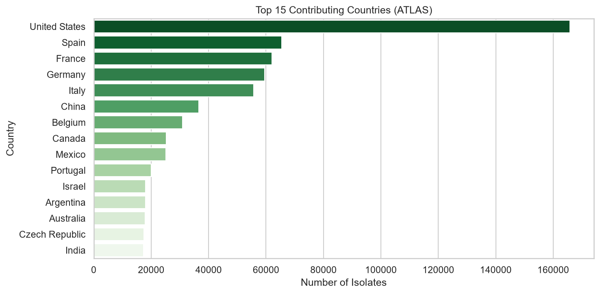</td>
</tr>
</table>

*Top 15 pathogens (left) and top 15 contributing countries (right) in the 1,011,168-isolate ATLAS cohort, 2004–2024.*


*Meropenem resistance climbs sharply for K. pneumoniae and A. baumannii, while oxacillin resistance in S. aureus (MRSA proxy) declines after 2017.*

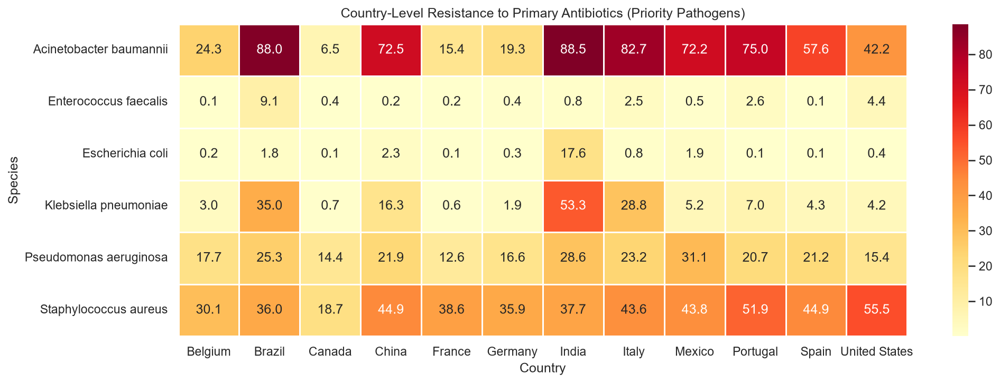

*Country-level resistance to each species' primary antibiotic among the 12 highest-volume ATLAS countries.*

<table>
<tr>
<td width="50%">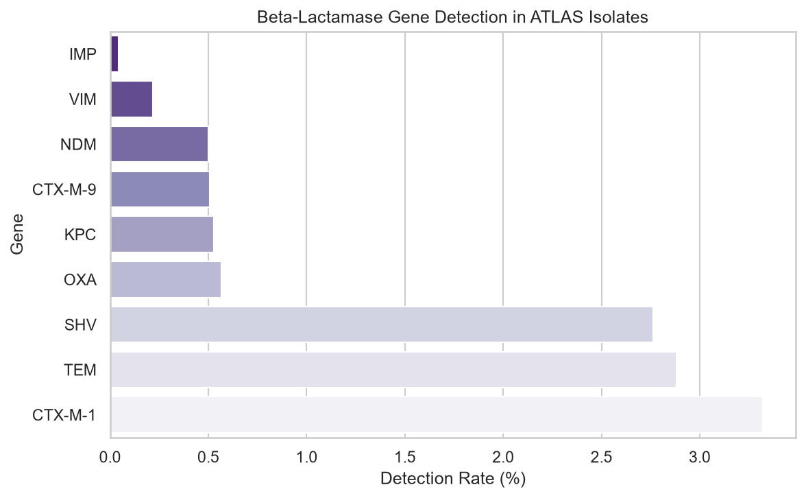</td>
<td width="50%">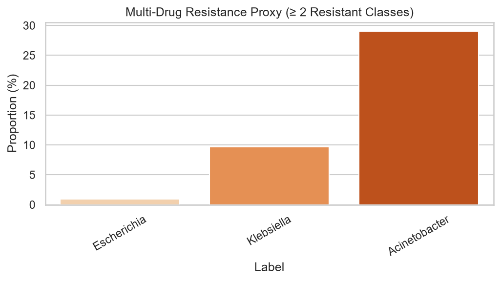</td>
</tr>
</table>

*Beta-lactamase gene detection rates (left) and a simple ≥2-class MDR proxy by priority species (right).*

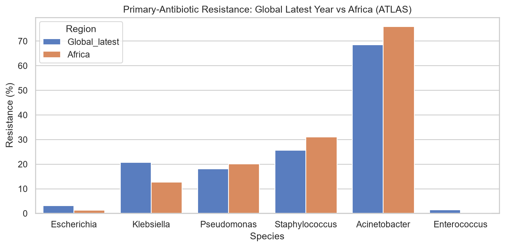

*Primary-antibiotic resistance: global latest-year rate vs. the African subset, by species — A. baumannii shows the largest Africa-specific excess.*

### KEYSTONE, Bedaquiline DREAM, and GASAR (Study III)

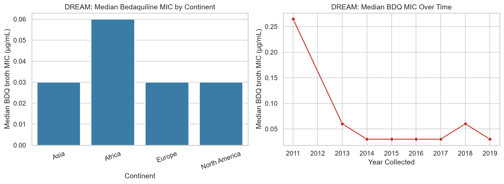

*Median bedaquiline MIC by continent (left) and over time (right) in the 5,928-isolate DREAM MDR/XDR-TB cohort.*

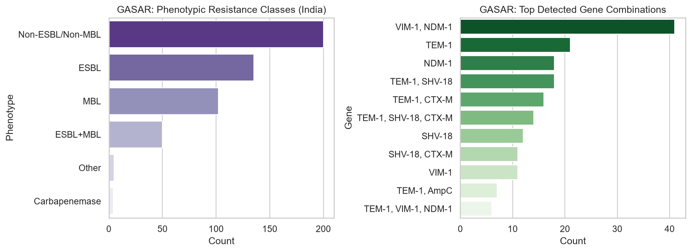

*Phenotypic resistance classes (left) and top detected beta-lactamase/carbapenemase gene combinations (right) among 496 GASAR isolates from India.*

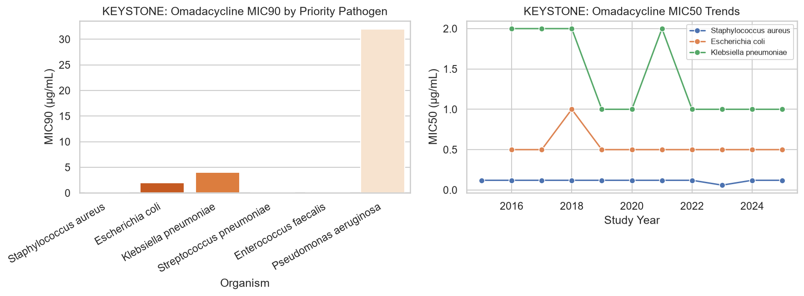

*Omadacycline MIC90 by priority pathogen (left) and MIC50 trends 2015–2025 (right) across 96,302 KEYSTONE isolates.*

### SPIDAAR RWE Study (Ghana, Kenya, Malawi, Uganda)

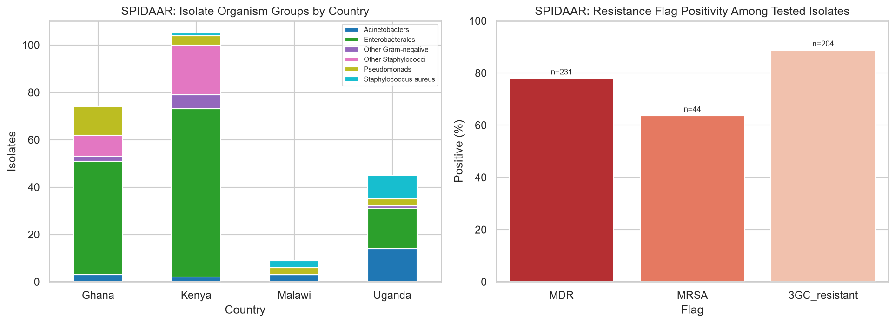

*Isolate organism groups by country (left) and MDR/MRSA/3GC-resistance flag positivity among tested isolates (right), n = 244 isolates.*

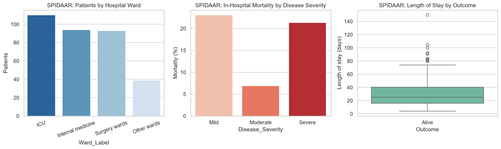

*Patients by hospital ward (left), in-hospital mortality by disease severity (middle), and length of stay by outcome (right), n = 336 patients.*

### Exploratory sample diagnostics (fast, first-200k-row ATLAS sample)

<table>
<tr>
<td width="33%">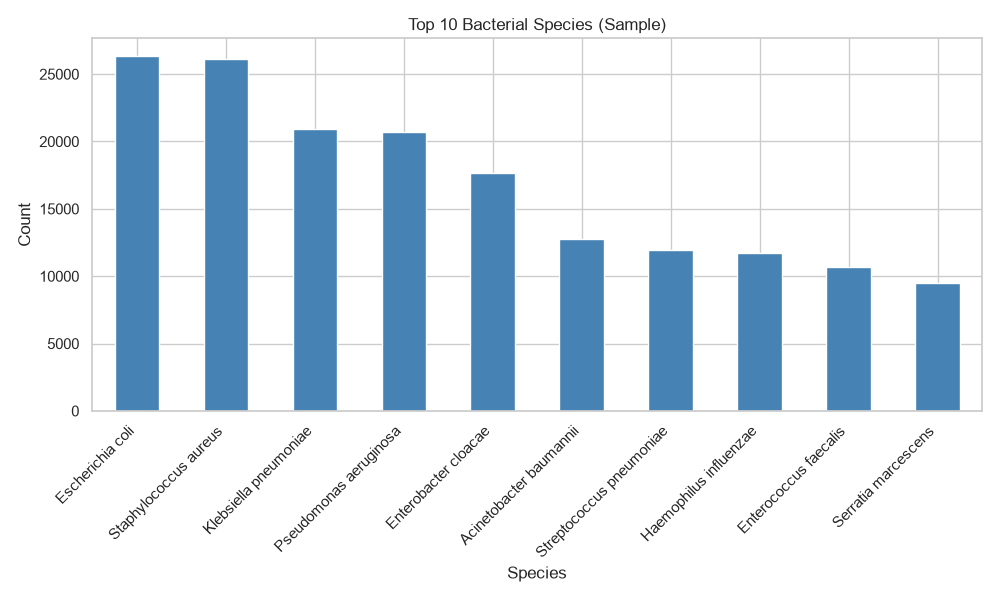</td>
<td width="33%">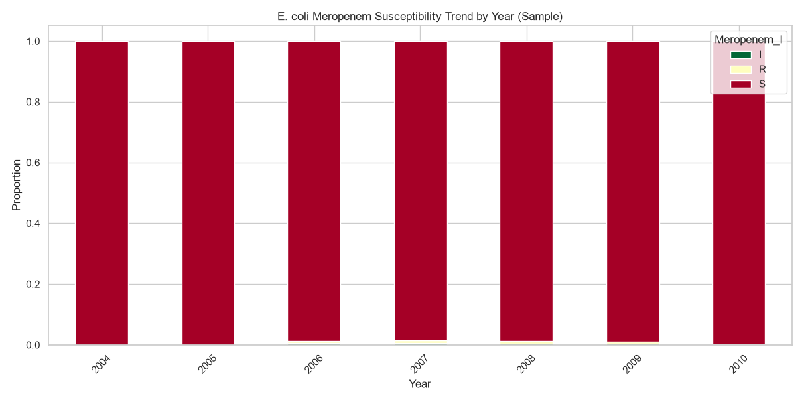</td>
<td width="33%">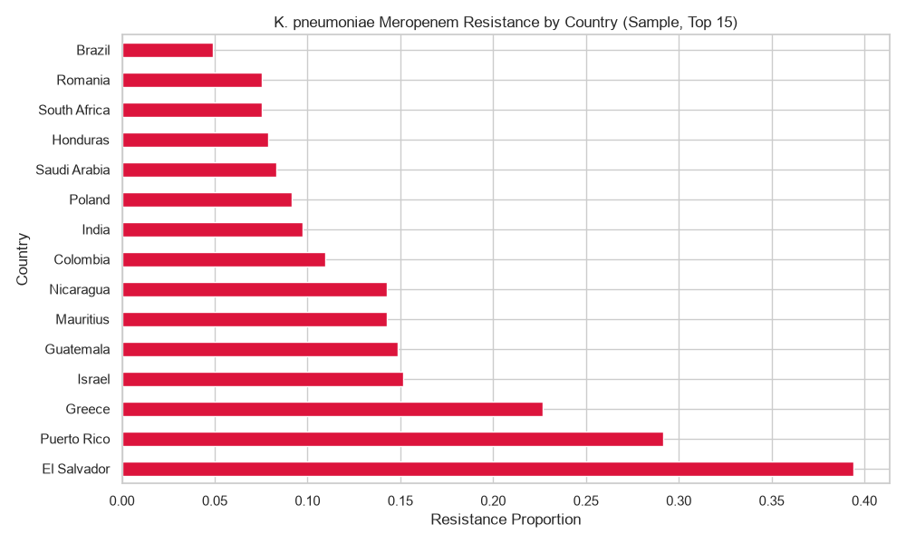</td>
</tr>
</table>

*Rapid diagnostic plots from `scripts/eda_surveilamr.py`, useful for quick iteration before running the full chunked pipeline. See [`outputs/figures/`](outputs/figures/) for the complete set (17 figures total, including `eda_ecoli_ceftriaxone_trend.png` and `eda_resistance_heatmap.png`).*

## Impact

SurveilAMR provides open, reusable dashboards and tables for empiric therapy support, ASP
early-warning triggers, MDR-TB bedaquiline monitoring, mechanism-aware stewardship, and
outcome-linked resistance surveillance in LMIC health systems such as Ghana's. The full
analytical narrative — including interpretation, cross-dataset synthesis, and stated
limitations — lives in [`notebooks/01_eda_surveilamr.ipynb`](notebooks/01_eda_surveilamr.ipynb).

## Limitations

- ATLAS African/LMIC coverage is sparse (2.9% of isolates, 12/83 countries); KEYSTONE has **zero** African sites.
- DREAM's `SubType` field required extensive free-text normalization (40+ raw spellings → 4 buckets); residual misclassification is possible.
- GASAR and SPIDAAR are small, single-country/region convenience samples (n = 496 and n = 244/336) — valuable for mechanism/outcome detail but not powered for precise prevalence estimation.
- SPIDAAR resistance-flag testing (MDR/MRSA/3GC-R) appears clinically-triggered rather than random, so positivity rates likely overstate true population prevalence.
- SPIDAAR `los` (length of stay) is populated only for patients discharged alive; mortality-linked duration should use `dtpta` (days-to-death) instead.
- The ATLAS MDR proxy (≥2 resistant classes among 2–3 tracked antibiotics) is a simplification of formal MDR/XDR/PDR classification (Magiorakos et al., 2012) and should be read as directional.
- The GASAR file is named for a target enrollment of 494 isolates (matching the study protocol supplied with the data request), but the delivered `_updated.xlsx` extract contains 496 rows — a minor discrepancy between the study protocol and the final dataset that we report as-is.

See [Section 8 of the notebook](notebooks/01_eda_surveilamr.ipynb) for the full discussion.

## Publication Acknowledgement

> This publication or presentation is based on research using data from Johnson & Johnson,
> Paratek, Pfizer, Venus Remedies Limited, obtained through [https://amr.vivli.org](https://amr.vivli.org)

## License

The code, notebooks, figures, and documentation in this repository are licensed under the
**MIT License** — see [LICENSE](LICENSE). Raw and processed Vivli AMR Register data are
**not** covered by this license, are not tracked in this repository, and remain governed by
the Vivli Data Use Agreement ([amr.vivli.org](https://amr.vivli.org)).

## References

- Vivli AMR Register: [https://amr.vivli.org](https://amr.vivli.org)
- 2026 Vivli AMR Surveillance Data Challenge: [https://amr.vivli.org/tag/datachallenge/](https://amr.vivli.org/tag/datachallenge/)
- Data Request 00013370 DOI: [https://doi.org/10.25934/PR00013370](https://doi.org/10.25934/PR00013370)
- Magiorakos, A.-P. et al. (2012). Multidrug-resistant, extensively drug-resistant and pandrug-resistant bacteria: an international expert proposal for interim standard definitions for acquired resistance. *Clinical Microbiology and Infection*, 18(3), 268–281.
- Methodological inspiration: [Vivli-AMR-data-challenge-2025-VIT-](https://github.com/Belindaharyini/Vivli-AMR-data-challenge-2025-VIT-)

## Citation

If you use this repository, please cite it as:

> Nana Safo Duker, Agnes Achiamaa Anane, and Marwin Afari. SurveilAMR: Surveillance Intelligence for Antimicrobial Resistance Trends (2026 Vivli AMR Surveillance Data Challenge). https://github.com/Nana-Safo-Duker/2026-Vivli-AMR-Data-Challenge-SurveilAMR

## Contact

Nana Safo Duker — freshsafoduker3@gmail.com
